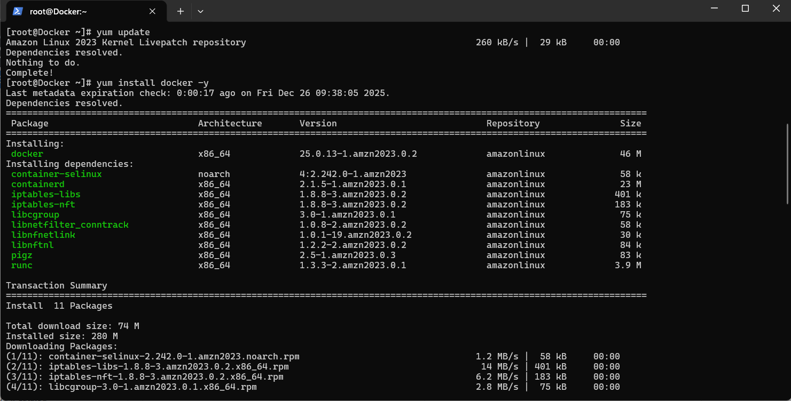
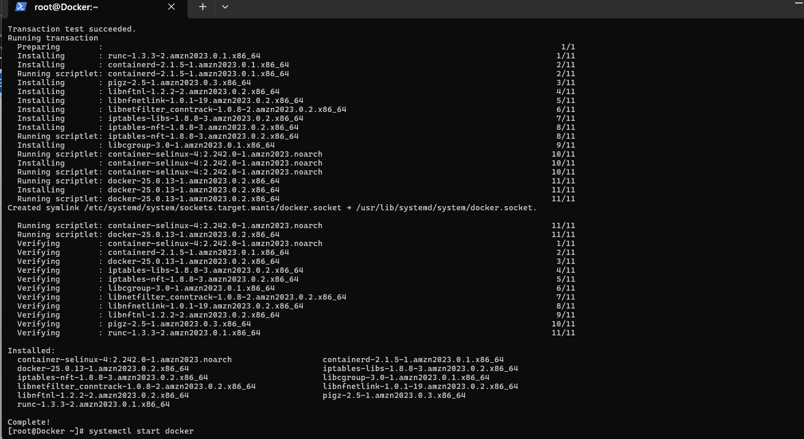
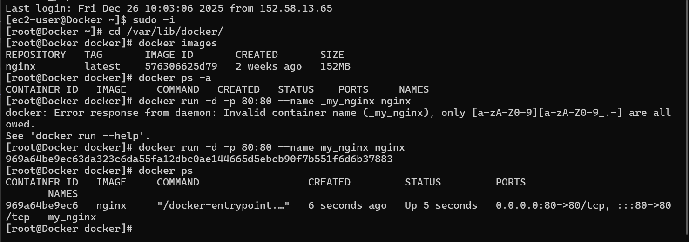
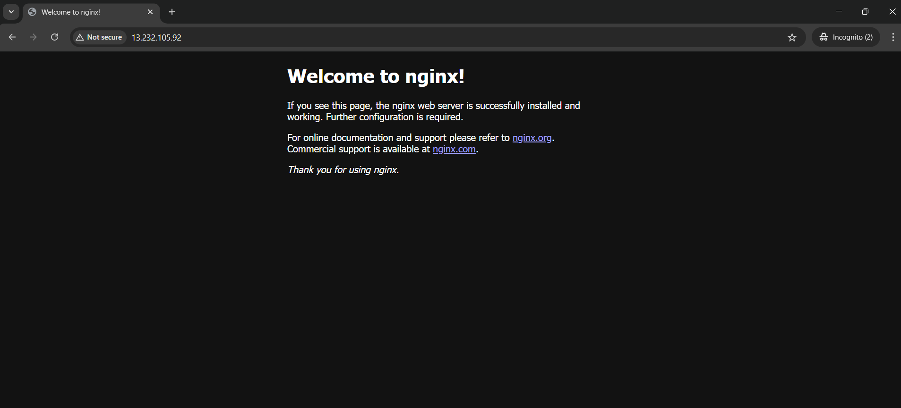

# Docker Installation and Nginx Container Deployment on AWS EC2

This project demonstrates the **installation of Docker on an AWS EC2 instance** and the deployment of an **Nginx container** with **port 80 exposed to the host**.

The goal of this project is to understand how Docker works in a real cloud environment and how containers can serve applications using port mapping.

---

## Project Overview

In this project, I performed the following steps:

- Launched an AWS EC2 instance
- Installed Docker on Amazon Linux
- Started and enabled the Docker service
- Pulled the official Nginx Docker image
- Ran an Nginx container
- Mapped container port **80** to host port **80**
- Verified the application using a web browser

This is a beginner-friendly Docker project focused on **hands-on learning** rather than theory.

---

## Technology Stack

- AWS EC2
- Amazon Linux 2023
- Docker
- Nginx
- Linux (CLI)
- Containerization

---

## Project Architecture

```

User Browser
|
|  HTTP (Port 80)
↓
AWS EC2 Instance
|
|  Port Mapping (80:80)
↓
Docker Container (Nginx)

```

---

## Project Structure

```

docker-nginx-project/
├── img/
│   ├── aws_instance.png
│   ├── docker_install_1.png
│   ├── docker_install_2.png
│   ├── docker_map_port.png
│   ├── nginx_webpage.png
└── README.md

````

---

## Step 1: AWS EC2 Instance Running

The EC2 instance is launched and running successfully on AWS.


---

## Step 2: Docker Installation

Docker is installed using the default Amazon Linux repository.

```bash
yum install docker -y
````

Docker packages and dependencies are installed successfully.




---

## Step 3: Start and Enable Docker Service

```bash
systemctl start docker
systemctl enable docker
systemctl status docker
```

Docker service is active and running.

---

## Step 4: Pull Nginx Image and Run Container

First, verify available images:

```bash
docker images
```

Run the Nginx container with port mapping:

```bash
docker run -d -p 80:80 --name my_nginx nginx
```

This maps:

* **Host port 80 → Container port 80**



---

## Step 5: Verify Running Container

```bash
docker ps
```

The Nginx container is running successfully.

---

## Step 6: Access Nginx from Browser

Open the EC2 public IP in a browser:

```
http://<EC2_PUBLIC_IP>
```

Nginx default welcome page confirms successful deployment.



---

## Key Learning Outcomes

Through this project, I learned:

* How to install Docker on AWS EC2
* How Docker services are managed using systemd
* Difference between images and containers
* How port mapping works in Docker
* How containers expose applications to the outside world
* How Docker simplifies application deployment

---

## Use Case

This setup is commonly used in:

* Learning Docker fundamentals
* Hosting containerized web applications
* DevOps and Cloud practice projects
* CI/CD pipeline foundations
* Microservices architecture basics

---

## Conclusion

This project helped me understand Docker from a **practical point of view**.

Instead of only learning commands, I focused on:

* Why containers are used
* How applications are exposed using port mapping
* How Docker behaves on a real cloud server

This forms a strong foundation for learning **Dockerfiles, Docker Compose, and Kubernetes** in the future.

---

## Author

**Raj Ahire**

* GitHub: [https://github.com/RajAhire-1](https://github.com/RajAhire-1)
* LinkedIn: [https://www.linkedin.com/in/raj-ahire](https://www.linkedin.com/in/raj-ahire)


